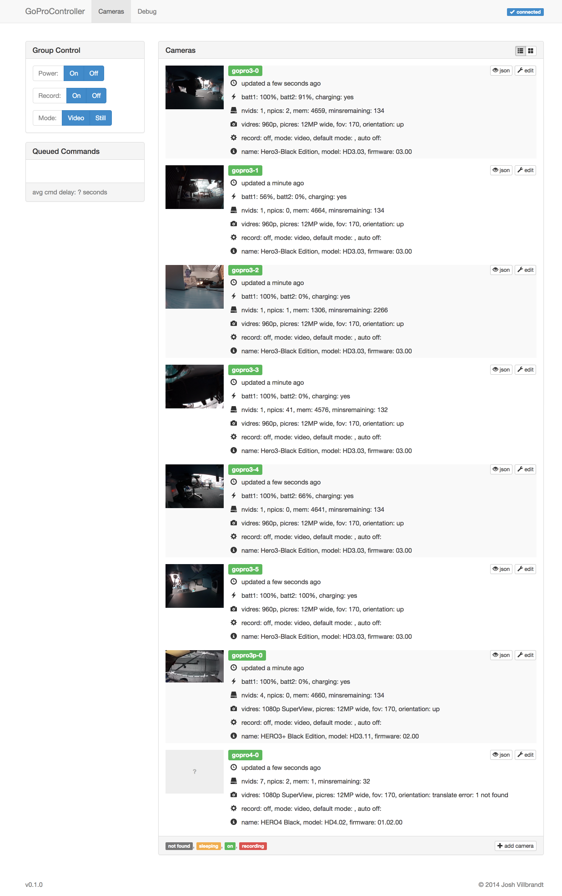

# GoProControllerUI

A responsive web interface for the [GoProController](https://github.com/joshvillbrandt/GoProController) API.

## Production Setup

The [GoProController](https://github.com/joshvillbrandt/GoProController) Apache config is already set up to serve the static files generated by this project. If you have GoProController setup, then installing the UI is as simple as:

```bash
git clone https://github.com/joshvillbrandt/GoProControllerUI.git ~/GoProControllerUI
sudo ln -s ~/GoProControllerUI /home/GoProControllerUI
cd ~/GoProControllerUI
npm install
npm run-script build
sudo service apache2 restart
```

Note, you'll have to change the `api_root` in [app/app.js](app/app.js) if you are hosting through Apache. If you are on the same machine as the server, a value like `http://localhost/api` could work. However, you should probably make `api_root` include your actual hostname instead of `localhost`.

## Development Setup

Clone the repo and install the code:

```bash
git clone https://github.com/joshvillbrandt/GoProControllerUI.git
cd GoProControllerUI
npm install
npm start
```

The UI should now be available at [http://localhost:9000/](http://localhost:9000/).

If you are hosting the GoProController on the same machine at the development, you should be able to immediately add cameras in the UI. If that doesn't seem to be working, follow the steps in the Production Setup to set the correct `api_root` URL. (The default `api_root` is `http://localhost:8000`.)

## Change History

This project uses [semantic versioning](http://semver.org/).

### v0.2.1 - future

* TODO: commanding
* TODO: debug interface

### v0.2.0 - 2014/11/24

* Initial release
* Live camera status updates from GoProController
* Add, edit, and remove cameras from GoProController

## Screenshot


